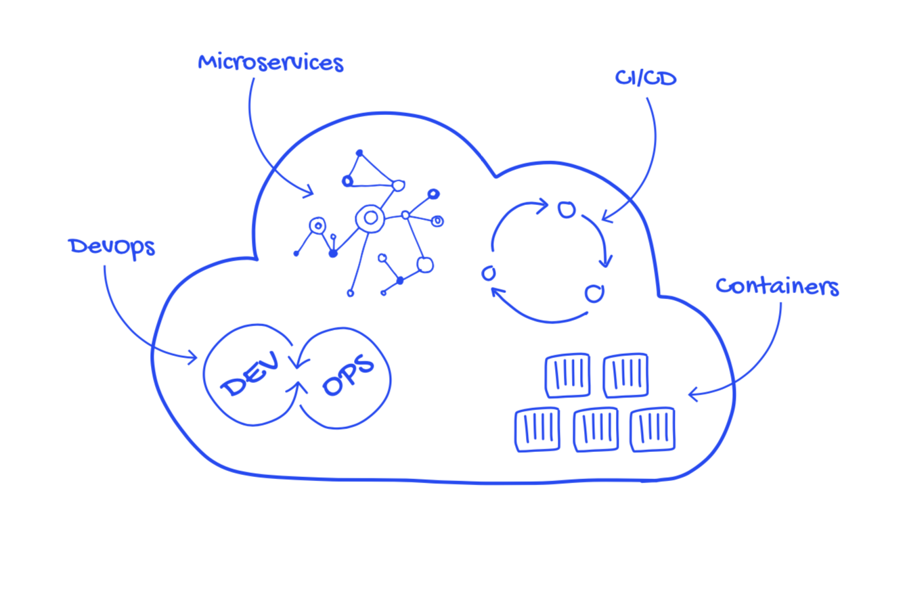

## 1. 云原生的来源

### 1.1 CNCF 与 CloudNative

[CNCF](https://cncf.io) 全称 Cloud Native Computing Foundation（云原生计算基金会），成立于 2015 年 7月 21 日，其最初的口号是坚持和整合开源技术来让编排容器作为微服务架构的一部分，是致力于云原生应用推广和普及的一支重要力量。

CNCF 作为一个厂商中立的基金会，致力于 Github 上的快速成长的开源技术的推广，如 Kubernetes、Prometheus、Envoy 等，帮助开发人员更快更好的构建出色的产品。

在谈 Prometheus 之前，我们先来谈谈 CloudNative 这个概念，这个概念在最近两年被炒得火热，所以云原生到底是个什么东西。CNCF 给出的定义如下：

> 云原生技术有利于各组织在公有云、私有云和混合云等新型动态环境中，构建和运行可弹性扩展的应用。云原生的代表技术包括容器、服务网格、微服务、不可变基础设施和声明式 API。
> 
> 这些技术能够构建容错性好、易于管理和便于观察的松耦合系统。结合可靠的自动化手段，云原生技术使工程师能够轻松地对系统作出频繁和**可预测**的重大变更。
>
> 云原生计算基金会（CNCF）致力于培育和维护一个厂商中立的开源生态系统，来推广云原生技术。我们通过将最前沿的模式民主化，让这些创新为大众所用。

### 1.2 Heroku 与 12-Factor

如果看了上述概念觉得不太懂的话，可以结合 [Heroku](http://www.heroku.com/) 公司提供的 [12factor](https://12factor.net/zh_cn/) 规范指南来理解。12-Factor 为构建如下的 SaaS 应用提供了方法论：

* 使用标准化流程自动配置，从而使新的开发者花费最少的学习成本加入这个项目。
* 和操作系统之间尽可能的划清界限，在各个系统中提供最大的可移植性。
* 适合部署在现代的云计算平台，从而在服务器和系统管理方面节省资源。
* 将开发环境和生产环境的差异降至最低，并使用持续交付实施敏捷开发。
* 可以在工具、架构和开发流程不发生明显变化的前提下实现扩展。

#### 12-Factor 内容

1. **基准代码**：一份基准代码，多份部署。
2. **依赖**：显式声明依赖关系。
3. **配置**：在环境中存储配置。
4. **后端服务**：把后端服务当作附加资源。
5. **构建**，发布，运行，严格分离构建和运行。
6. **进程**：以一个或多个无状态进程运行应用。
7. **端口绑定**：通过端口绑定提供服务。
8. **并发**：通过进程模型进行扩展。
9. **易处理**：快速启动和优雅终止可最大化健壮性。
10. **开发环境与线上环境等价**：尽可能的保持开发，预发布，线上环境相同。
11. **日志**：把日志当作事件流。
12. **管理进程**：后台管理任务当作一次性进程运行。

***CloudNative 概念组成***

DevOps、Microservices、CI/CD、Containers 这些概念融会贯通后形成 CloudNative 这个大概念。

### 1.3 云原生和监控的关系

云原生和监控首先是两个「独立且完整」的概念，云原生的应用强调「可观测性」，而可观测性大致可归纳为三点，**监控**、**日志**、**调用链追踪**。也就是说 **监控应该是云原生概念的一个子集**。
