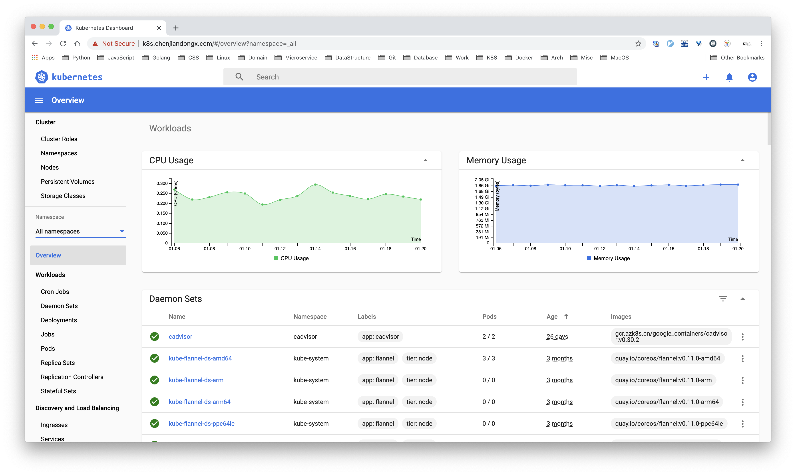

## 3. 搭建测试环境

### 3.1 集群环境

主要的折腾环境是在 Kubernetes 集群上，集群是在本地搭建的。使用 VMware 虚拟机，系统为 CentOS7，三节点一主两从。本文不对如何搭建 Kubernetes 集群作详细介绍，这不是本文讨论的重点。都 2020 年了，是时候学会自己搭建一个集群啦，其实也不难，参照官网教程即可。

🤔 如果不想搭建个多节点的集群，使用 [kubernetes/minikube](https://github.com/kubernetes/minikube) 也是可以的，作为测试也完全足够。

### 3.2 集群节点信息

```shell
~ 🐶 which k
k: aliased to kubectl

~ 🐶 k get nodes
NAME     STATUS   ROLES    AGE   VERSION
master   Ready    master   95d   v1.16.2
node1    Ready    <none>   95d   v1.16.2
node2    Ready    <none>   95d   v1.16.2

~ 🐶 k top nodes
NAME     CPU(cores)   CPU%   MEMORY(bytes)   MEMORY%
master   98m          4%     926Mi           41%
node1    92m          4%     873Mi           50%
node2    113m         5%     921Mi           53%
```

***Kubernetes Dashboard***



推荐几个部署 kubernetes 集群的相关教程

* [2019 最新 k8s 集群搭建教程 (centos k8s 搭建)](https://juejin.im/post/5cb7dde9f265da034d2a0dba)
* [create-cluster-kubeadm](https://kubernetes.io/docs/setup/production-environment/tools/kubeadm/create-cluster-kubeadm/)
* [和我一步步部署 kubernetes 集群](https://github.com/opsnull/follow-me-install-kubernetes-cluster)
