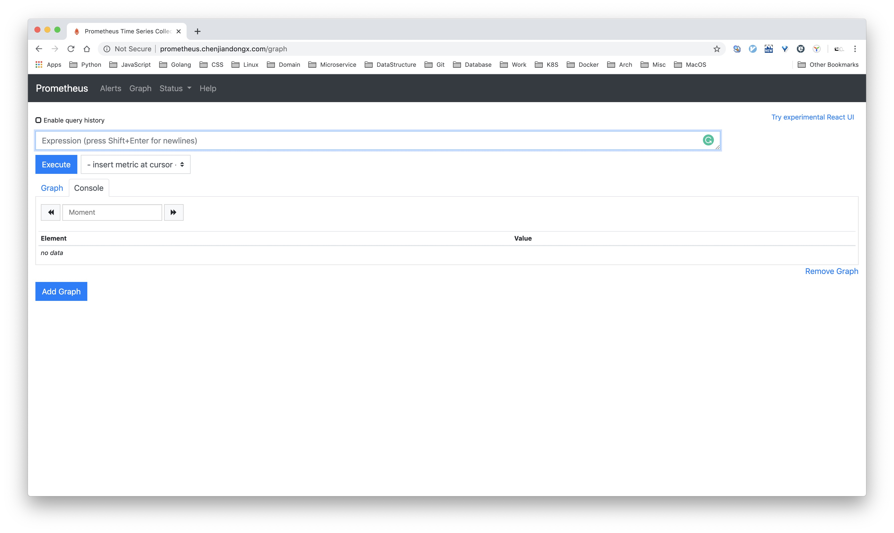
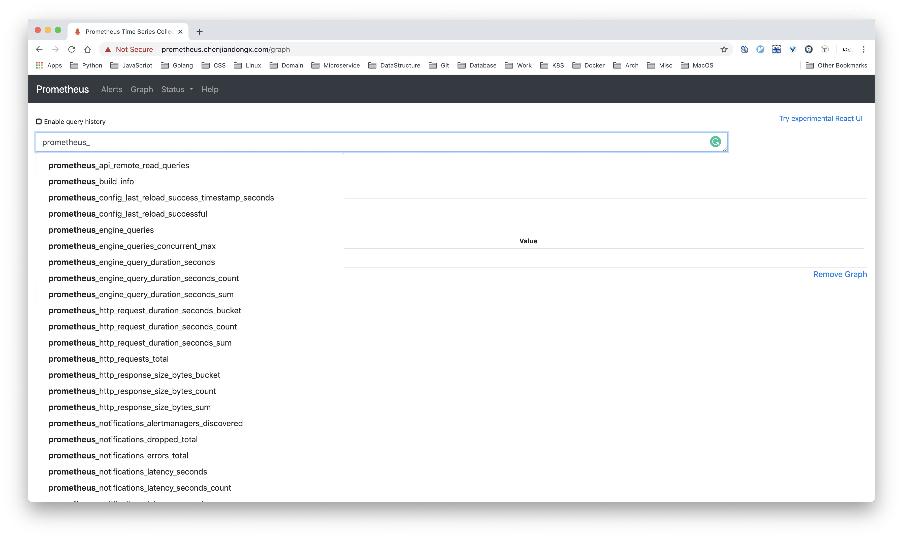
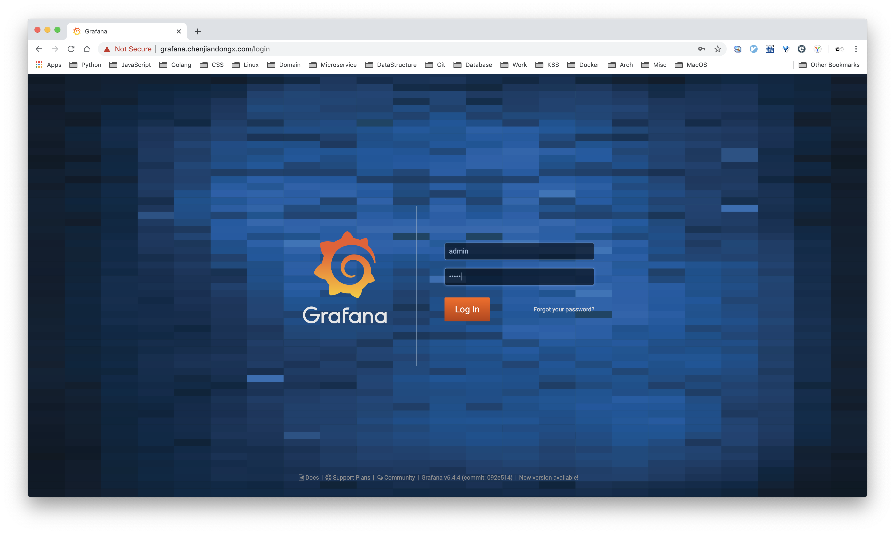

## 6. Prometheus 实践（入门篇）

### 6.1 prometheus-operator 是什么？

要想了解 prometheus-operator，那就得先了解 operator 是什么。operator 是一种部署和管理 Kubernetes 应用的解决方案。Kubernetes 作为一个成熟的容器编排系统，在无状态服务的管理上已经做得非常好，使开发人员可以迅速地开发和部署高可用的服务。

但是对于有状态的应用来说，情况就变得复杂了，如何在 Kubernetes 上迅速部署一个易于后期维护 Kafka 集群或者 Mongo 集群？有状态的应用我们常常需要考虑很多复杂的事情，包括升级、配置更新、备份、灾难恢复、Scale 调整数量等等，有时甚至可能要重启一些服务，一些基础组件由于自身系统架构的复杂性，加上又可能存在分布式的情况，所以这对于在 Kubernetes 的运维人员来说，着实也是一件头疼的事情。

因此 operator 出现了，operator 充分利用了 Kubernetes 的可扩展性，通过注册 [Kubernetes CRD](https://kubernetes.io/docs/concepts/extend-kubernetes/api-extension/custom-resources/) 来抽象和管理系统组件，将复杂的运维工作与 Kubernetes runtime 接口相结合，对外屏蔽了操作的复杂性，实乃运维人员之福音 👏。

[CoreOS](https://coreos.com/) 公司最先提出了 operator 这个概念，并开源了 [operator-framework](https://github.com/operator-framework)，以及两个社区知名的 operator 实现，[prometheus-operator](https://github.com/coreos/prometheus-operator) 和 [etcd-operator](https://github.com/coreos/etcd-operator)。

***prometheus-operator 架构***


prometheus-operator 有以下几种自定义资源：

* **Prometheus**：Prometheus 服务端实例。
* **ServiceMonitor**：基于 Service 监控实例，是对要抓取 Service Metircs 的规则描述。
* **PodMonitor**：基于 Pod 监控实例，是对要抓取 Pod Metircs 的规则描述。
* **PrometheusRule**：告警规则和指标计算规则。
* **Alertmanager**：Alertmanager 服务端实例。

### 6.2 部署 prometheus-operator

下面开始在 Kubernetes 上部署 prometheus-operator。按照官方文档指引

```shell
$ git clone https://github.com/coreos/prometheus-operator.git
$ cd rometheus-operator
$ kubectl apply -f bundle.yaml
```

> Note：敲黑板！划重点！

由于总所周知的原因，如果你本地没配置好「特殊」环境的话是拉不了 quay.io 的镜像的。解决方案有二：

* (推荐) 配置代理环境，可参考我的一篇博客 [Docker 解决拉取镜像被墙的问题](https://github.com/chenjiandongx/blog/blob/master/posts/fix-docker-pull-images.md)。
* 使用微软镜像源 [GCR Proxy Cache](http://mirror.azure.cn/help/gcr-proxy-cache.html)，把下载后的镜像重新打 tag 并手动同步到所有节点上。

    1. 获取 image 版本信息
    ```shell
    $ cat bundle.yaml | grep image
            - --config-reloader-image=jimmidyson/configmap-reload:v0.3.0
            image: quay.io/coreos/prometheus-operator:v0.35.0
    ```

    2. 替换 image 地址
    ```shell
    # 拉取镜像
    $ docker pull quay.azk8s.cn/coreos/prometheus-operator:v0.35.0
    # 重新打 tag
    $ docker tag quay.azk8s.cn/coreos/prometheus-operator:v0.35.0 quay.io/coreos/prometheus-operator:v0.35.0
    ```

    3. 将镜像拉取策略修改为 `imagePullPolicy: IfNotPresent`

一切准备完毕之后应该就可以顺利地安装 operator 了，查看新注册的 CRD 以及 operator 实例。

```shell
~ 🐶 k get crds | grep monitoring
alertmanagers.monitoring.coreos.com     2019-11-18T06:11:26Z
podmonitors.monitoring.coreos.com       2019-11-18T06:11:27Z
prometheuses.monitoring.coreos.com      2019-11-18T06:11:26Z
prometheusrules.monitoring.coreos.com   2019-11-18T06:11:27Z
servicemonitors.monitoring.coreos.com   2019-11-18T06:11:26Z

~ 🐶 k get pods | grep operator
prometheus-operator-99dccdc56-89rlt      1/1     Running   25         78d
```

### 6.3 使用 prometheus-operator

1. 部署 prometheus 服务端实例，用于抓取 Job Metrics。
    ```yaml
    # prometheus-frontend.yaml
    apiVersion: monitoring.coreos.com/v1
    kind: Prometheus
    metadata:
      name: prometheus
    spec:
      serviceAccountName: prometheus
      # prometheus 版本
      version: v2.14.0
      serviceMonitorSelector:
        # 声明 labels，就当你是前端团队吧 🐶
        matchLabels:
          team: frontend
      podMonitorSelector:
        matchLabels:
          team: frontend
      resources:
        requests:
        memory: 400Mi
      enableAdminAPI: false
      # Note: 这里有个地方需要提醒下，prometheus.spec 有 stroage 选项，可以指定 PVC，用于持久化存储监控指标数据。
      # 线上环境请使用 PVC，这里只是做测试用的，所以没有挂载持久化卷啦。

    # Note: 如果镜像未能成功拉取，请参考上面给出的方案，屡试不爽。
    # k apply -f prometheus-frontend.yaml
    ```

    查看实例运行情况
    ```shell
    ~ 🐶 k get pods | grep prometheus
    prometheus-operator-99dccdc56-89rlt      1/1     Running   25         78d
    prometheus-prometheus-0                  3/3     Running   73         76d

    # 可以看到，一个 prometheus pod 里面有三个容器。
    # 除了一个实际真正的 prometheus 服务端容器之外，还有另外两个容器是用于重载配置文件的。
    ~ 🐶 k describe pod prometheus-prometheus-0 | grep Image:
        Image:         quay.io/prometheus/prometheus:v2.14.0
        Image:         quay.io/coreos/prometheus-config-reloader:v0.34.0
        Image:         quay.io/coreos/configmap-reload:v0.0.1
    ```

2. 部署 prometheus-service
    ```yaml
    # prometheus-svc.yaml
    apiVersion: v1
    kind: Service
    metadata:
      # 这个 service 在后面的 Ingress 会用到
      name: prometheus
    spec:
      type: ClusterIP
      ports:
      - name: web
        port: 9090
        protocol: TCP
        targetPort: web
      selector:
        prometheus: prometheus

    # k apply -f prometheus-svc.yaml
    ```

3. 部署 prometheus-pod-monitor。不知道要监控什么的话那就先监控自己吧 😅。
    ```yaml
    # prometheus-pod-monitor.yaml
    apiVersion: monitoring.coreos.com/v1
    kind: PodMonitor
    metadata:
      name: prometheus-monitor
      labels:
        team: frontend
    spec:
      selector:
        matchLabels:
          # 这是我们前面部署的 prometheus 服务端实例
          prometheus: prometheus
      jobLabel: "prometheus-monitor"
      podMetricsEndpoints:
      - port: web

    # k apply -f prometheus-pod-monitor.yaml
    ```

到目前为止，我们所了解到和看到的一切，好像都比较... 抽象 😜，搞个可视化面板吧。Prometheus 本身自带了一个 dashboard，虽然说比较简陋，不管了，先搞起来再说。

***Prometheus Dashboard***


这里我使用了 Ingress-Nginx 来做代理转发，并修改本地 Host 实现的，毕竟咱也没服务器在线上搞。这里可以参考我的另外一篇博客 [kubernetes 之 Ingress-Controller](https://github.com/chenjiandongx/blog/blob/master/posts/k8s-ingress-controller.md)，也不是什么复杂的工作，主要的步骤如下。

1. 安装 Ingress-nginx
   ```shell
   $ kubectl apply -f https://raw.githubusercontent.com/kubernetes/ingress-nginx/master/deploy/static/mandatory.yaml
   ```

2. 部署 Ingress 实例
    ```yaml
    # ingress-prometheus.yaml
    apiVersion: extensions/v1beta1
    kind: Ingress
    metadata:
      name: ingress-prometheus
      namespace: default
      annotations:
        kubernetes.io/ingress.class: "nginx"
        nginx.ingress.kubernetes.io/backend-protocol: "HTTP"
    spec:
      rules:
      - host: prometheus.chenjiandongx.com
        http:
          paths:
          - path: /
            backend:
              # 前面我们已经部署了一个 prometheus-service，暴露的端口为 9090
              serviceName: prometheus
              servicePort: 9090

    # k apply -f ingress-prometheus.yaml
    ```

    查看 Ingress 资源
    ```shell
    $ k get ingresses | grep prome
    ingress-prometheus     prometheus.chenjiandongx.com     10.106.96.52   80      69d
    ```

3. 修改本地 host
    ```shell
    $ vim /etc/hosts

    # 192.168.2.11 是我 Kubernetes 集群 master 节点的 IP
    192.168.2.11 prometheus.chenjiandongx.com
    ```

4. 再加一层 Nginx 实现第二层转发，让界面看起来优雅一些（自欺欺人！）。

    kubeadm 在安装 Kubernetes 集群的时候，NodePort 端口默认只开放 30000+，这也是 ingress-controller-svc 的 HTTP/HTTPS 端口都被映射到 30000+ 的原因。所以我们虽然配置了域名，但是访问的时候还是需要把端口带上。比如 http://prometheus.chenjiandongx.com:30834 我还是喜欢直接访问 http://prometheus.chenjiandongx.com （傲娇脸！）。所以我们可以在 master 节点上再新增一个 nginx 来做 4 层转发，这样我们就可以达到我们想要的效果啦！

验证我们刚才监控 prometheus 自己的操作是否成功，诺！`prometheus_*` metircs 就是 prometheus 自己上报的指标啦！



### 6.4 Grafana 是什么？

[Grafana](https://grafana.com/) 是一个跨平台的开源的度量分析和可视化工具，可通过将采集的数据查询然后可视化的展示，并及时通知。它主要有以下六大特点

1. **灵活的图表编排**：面板插件有许多不同方式的可视化指标和日志，官方库中具有丰富的仪表盘插件，比如热图、折线图、图表等多种展示方式。
2. **支持多种数据源**：Graphite、InfluxDB、MySQL、OpenTSDB、Prometheus、Elasticsearch、CloudWatch 和 KairosDB 等。
3. **告警通知**：以可视方式定义最重要指标的警报规则，Grafana 将不断计算并发送通知，在数据达到阈值时通过 Slack、PagerDuty 等获得通知。
4. **混合展示**：在同一图表中混合使用不同的数据源，可以基于每个查询指定数据源，甚至自定义数据源。
5. **注释**：使用来自不同数据源的丰富事件注释图表，将鼠标悬停在事件上会显示完整的事件元数据和标记。
6. **过滤器**：Ad-hoc 过滤器允许动态创建新的键/值过滤器，这些过滤器会自动应用于使用该数据源的所有查询。

Grafana 是一个非常棒的可视化组件，给予了开发者无限的可能，待提高的是使用者的想象力 😳。

### 6.5 部署 Grafana

1. 部署 grafana StatefulSet 到 Kubernetes 中。
    ```yaml
    # grafana-statefulset.yaml
    apiVersion: apps/v1
    kind: StatefulSet
    metadata:
      name: grafana
    spec:
      serviceName: "grafana-svc"
      replicas: 1
      selector:
        matchLabels:
          app: grafana
      template:
        metadata:
          labels:
            app: grafana
        spec:
          containers:
          - name: grafana
            image: grafana/grafana:6.4.4
            ports:
            # 暴露 3000 端口，这是 Grafana 的默认端口
            - containerPort: 3000
              name: web
            volumeMounts:
            - name: grafana-data
              mountPath: /var/lib/grafana
    volumeClaimTemplates:
    - metadata:
        name: grafana-data
        annotations:
          # 这里使用了 nfs 作为 storageclass，关于 stroageclass 部署可以参考博客文章
          # https://github.com/chenjiandongx/blog/blob/master/posts/k8s-nfs-storageclass.md
          volume.beta.kubernetes.io/storage-class: nfs-storage
        spec:
          accessModes: [ "ReadWriteOnce" ]
        resources:
          requests:
            storage: 1Gi

    # k apply -f grafana-statefulset.yaml
    ```

2. 部署 grafana-svc
    ```yaml
    # grafana-svc.yaml
    kind: Service
    apiVersion: v1
    metadata:
      name: grafana-svc
      labels:
        app: grafana
    spec:
      selector:
        app: grafana
      ports:
      - name: web
        port: 3000

    # k apply -f grafana-svc.yaml
    ```

3. 部署 Ingress 转发 http://grafana.chenjiandongx.com 域名（🧐 非必须，也可以将 grafana-svc 暴露成 NodePort 形式，使用 IP 访问）
    ```yaml
    # ingress-grafana.yaml
    apiVersion: extensions/v1beta1
    kind: Ingress
    metadata:
      name: ingress-grafana
      namespace: default
      annotations:
        kubernetes.io/ingress.class: "nginx"
        nginx.ingress.kubernetes.io/backend-protocol: "HTTP"
    spec:
      rules:
      - host: grafana.chenjiandongx.com
        http:
          paths:
            - path: /
              backend:
                # 与上面 svc 名称对应
                serviceName: grafana-svc
                servicePort: 3000

    # k apply -f ingress-grafana.yaml
    # 记得在 /etc/hosts 上补充 grafana.chenjiandongx.com DNS 解析记录
    ```

访问 http://grafana.chenjiandongx.com 即可看到登录页面。默认账号密码均为 admin。


