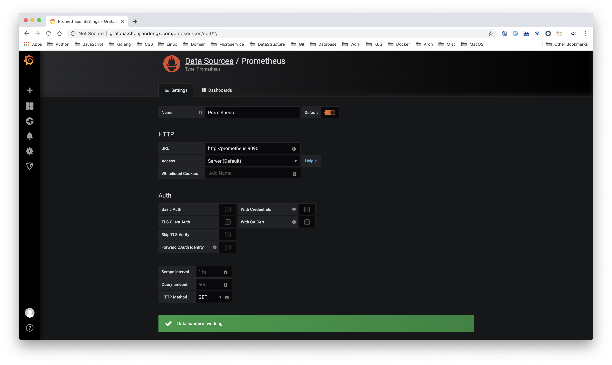
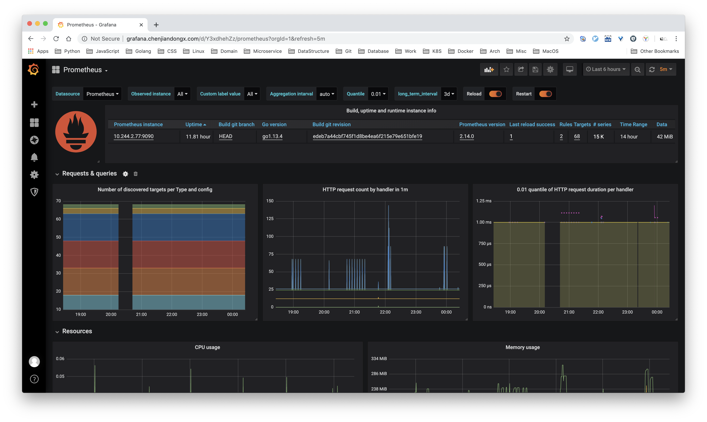
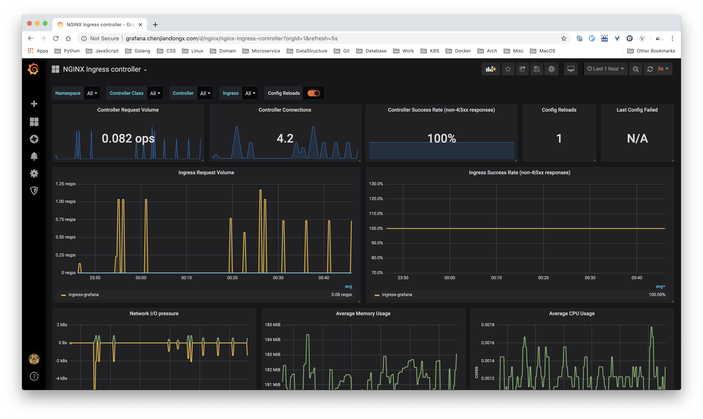
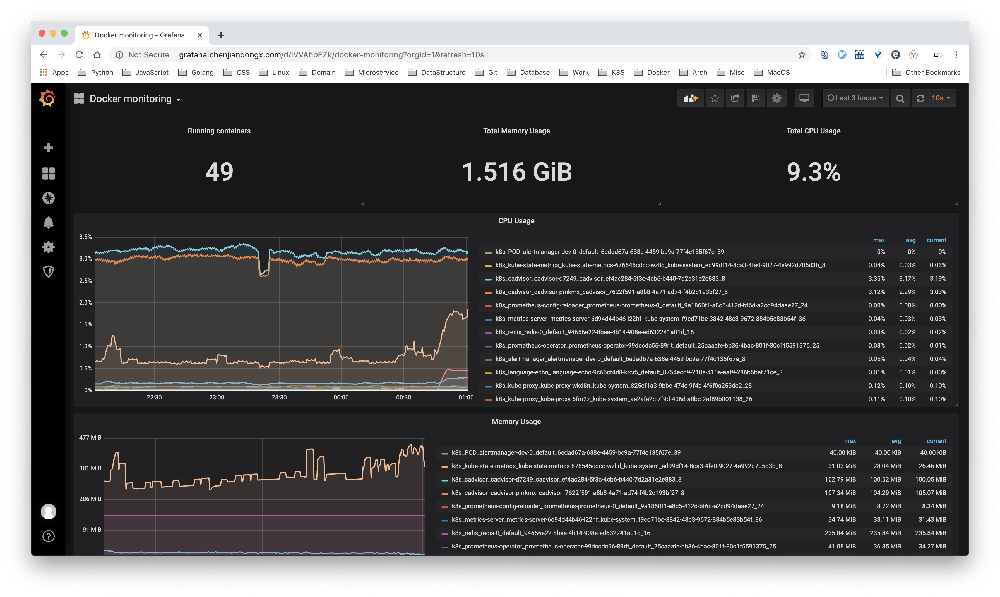
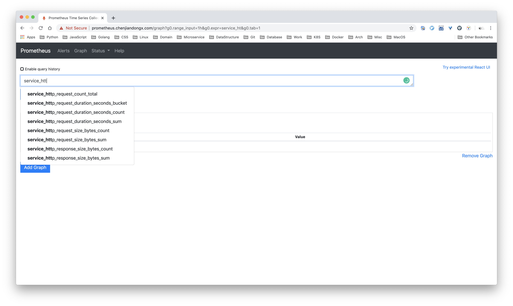
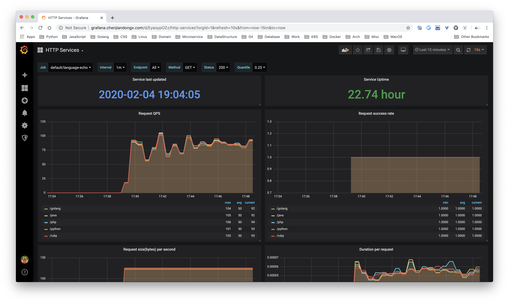

## 7. Prometheus 实践（进阶篇）

### 7.1 使用酷炫的 Grafana 界面

要使用 Grafana 首先需要添加数据源，因为我们这里使用的仅是 Prometheus，所以我们暂先把上面部署的 prometheus service 添加为默认数据源，因为 prometheus-svc 也是部署在 default 命名空间，暴露端口为 9090，因此 URL 为 `http://prometheus:9090`。点击 `Save & Test`。



#### 7.1.1 grafana-prometheus

接下来就是我们大显身手的时候了，刚才上面一开始我们监控了 prometheus 自己，这回有了 Grafana，就可以用更加「专业（高逼格！）」的图表来可视化数据了。

> 配置 JSON 文件：[grafana-prometheus.json](./exmaple/grafana-prometheus.json)



#### 7.1.2 grafana-ingress

前面我们也部署了 Ingress-Nginx 用于域名的转发，Kubernetes 官方提供的 nginx-ingress-controller 是有上报 `/metrics` 的接口的，不过为了配合 prometheus-operator 使用，我们需要修改点内容。

prometheus-operator 的 monitor 如若需要指定端口的话，必须为其 `name`，不能为端口号。至于为什么一定要这样，我也不是很清楚，因为源码中就是这么规定的...

```shell
# 使用 vim 搜索 `ports`，找到 container port 为 10254 的端口，新增 `name: web` 配置。
$ k edit deployments.apps -n ingress-nginx nginx-ingress-controller

# 修改后如下
- containerPort: 10254
  name: web
  protocol: TCP
```

修改完成之后就可以部署 ingress-pod-monitor，告诉 prometheus 可以去抓取数据 ingress 上报的数据。
```yaml
# ingress-pod-monitor.yaml
apiVersion: monitoring.coreos.com/v1
kind: PodMonitor
metadata:
  labels:
    team: frontend
  name: ingress-monitor
  namespace: default
spec:
  namespaceSelector:
    matchNames:
    # ingress-nginx 默认是部署在 `ingress-nginx` 命名空间下
    - ingress-nginx
  podMetricsEndpoints:
  # 必须为 name，不能为端口号
  - port: web
  selector:
    matchLabels:
      app.kubernetes.io/name: ingress-nginx
      app.kubernetes.io/part-of: ingress-nginx

# k apply -f ingress-pod-monitor.yaml
```

> 配置 JSON 文件：[grafana-ingress.json](./exmaple/grafana-ingress.json)



#### 7.1.3 grafana-docker

[cadvisor](https://github.com/google/cadvisor) 是 Google 开源的 docker 容器监控组件，提供原生的 Prometheus metrics 接口。部署可以参照官方文档，[deploy/kubernetes](https://github.com/google/cadvisor/tree/master/deploy/kubernetes)，挺方便的。官方的部署方案会在每个非 master 节点上都配置一个 cadvisor 实例，以 daemonsets.apps 的形式。
```shell
~ 🐶 k get pods -n cadvisor -o wide
NAME             READY   STATUS    RESTARTS   AGE   IP             NODE    NOMINATED NODE   READINESS GATES
cadvisor-d7249   1/1     Running   8          26d   10.244.2.73    node2   <none>           <none>
cadvisor-pmkmx   1/1     Running   8          26d   10.244.1.130   node1   <none>           <none>
```

同样的，我们需要告知 Prometheus 来抓取 cadvisor 上报的数据。
```yaml
# cadvidor-svc-monitor.yaml
apiVersion: monitoring.coreos.com/v1
kind: ServiceMonitor
  labels:
    team: frontend
  name: cadvisor
  namespace: default
spec:
  endpoints:
  - port: web
  namespaceSelector:
    matchNames:
    - cadvisor
  selector:
    matchLabels:
      app.kubernetes.io/name: cadvisor

# k apply cadvidor-svc-monitor.yaml
# Note: 实际上我们应该使用的 pod-monitor 而不是 service-monitor，这里这么做只是为了贪图方便。（心虚！）
```
> 配置 JSON 文件：[grafana-docker.json](./exmaple/grafana-docker.json)



#### 7.1.4 grafana-node-exporter

[Node-exporter](https://github.com/prometheus/node_exporter) 是 Prometheus 团队开发的用于监控主机指标的组件，也算是目前最热门的 exporter 实现之一。监控的指标蛮齐全的，该有的都有了 🙌。

我们也把 node-exporter 用 daemonsets 的形式部署起来。
```yaml
# node-exporter-ds.yaml
apiVersion: apps/v1
kind: DaemonSet
metadata:
  name: node-exporter
  labels:
    name: node-exporter
spec:
  selector:
    matchLabels:
      name: node-exporter
  template:
    metadata:
      labels:
        name: node-exporter
      annotations:
         prometheus.io/scrape: "true"
         prometheus.io/port: "9100"
    spec:
      hostPID: true
      hostIPC: true
      hostNetwork: true
      containers:
        - name: node-exporter
          image: prom/node-exporter:latest
          imagePullPolicy: IfNotPresent
          securityContext:
            privileged: true
          args:
            - --path.rootfs
            - /host
          ports:
            - containerPort: 9100
              protocol: TCP
              name: web
          volumeMounts:
            - name: rootfs
              mountPath: /host
              readOnly: true
      volumes:
        - name: rootfs
          hostPath:
            path: /

# k apply -f node-exporter-ds.yaml
```

然后再把 prometheus pod-monitor 规则也部署好
```yaml
# node-exporter-pod-monitor.yaml
apiVersion: monitoring.coreos.com/v1
kind: PodMonitor
metadata:
  name: node-exporter-monitor
  labels:
    team: frontend
spec:
  selector:
    matchLabels:
      name: node-exporter
  jobLabel: "node-exporter-monitor"
  podMetricsEndpoints:
  - port: web

# k apply -f node-exporter-pod-monitor.yaml
```

> 配置 JSON 文件：[grafana-node-exporter.json](./exmaple/grafana-node-exporter.json)


### 7.2 如何编写一个 exporter

前面所使用的都是其他开发者编写的 exporter，那如果我们自己也想根据业务需求来编写一个 exporter，提供 `/metrics` 路由向 Prometheus 上报数据呢。

目前在业务开发中，我所使用的 Golang Web 框架是 [Gin](https://github.com/gin-gonic/gin)，Gin 是一个精巧的框架，API 设计得挺优雅，性能也不错。所以我为 Gin 开发了一个 Middleware [ginprom](https://github.com/chenjiandongx/ginprom) 并提供了相应的 Grafana 面板。总代码量也就 100 多行，下面进行源码剖析 🐶。

```golang
// https://github.com/chenjiandongx/ginprom/blob/master/middleware.go
// 我们挑重点的来，省略非核心代码

// 命名空间，生成的 metrics 格式为 service_*
const namespace = "service"

var (
	// 对于一个 HTTP 请求，我们需要携带的数据有 status, endpoint, method
	labels = []string{"status", "endpoint", "method"}

	// 服务启动的时间，重启清零。
	uptime = prometheus.NewCounterVec(
		prometheus.CounterOpts{
			Namespace: namespace,
			Name:      "uptime",
			Help:      "HTTP service uptime.",
		}, nil,
	)

	// Counter 是单调递增，记录请求总数
	reqCount = prometheus.NewCounterVec(
		prometheus.CounterOpts{
			Namespace: namespace,
			Name:      "http_request_count_total",
			Help:      "Total number of HTTP requests made.",
		}, labels,
	)

	// 请求延迟时间
	reqDuration = prometheus.NewHistogramVec(
		prometheus.HistogramOpts{
			Namespace: namespace,
			Name:      "http_request_duration_seconds",
			Help:      "HTTP request latencies in seconds.",
		}, labels,
	)

	// 请求体大小
	reqSizeBytes = prometheus.NewSummaryVec(
		prometheus.SummaryOpts{
			Namespace: namespace,
			Name:      "http_request_size_bytes",
			Help:      "HTTP request sizes in bytes.",
		}, labels,
	)

	// 响应体大小
	respSizeBytes = prometheus.NewSummaryVec(
		prometheus.SummaryOpts{
			Namespace: namespace,
			Name:      "http_response_size_bytes",
			Help:      "HTTP request sizes in bytes.",
		}, labels,
	)
)

// 初始化操作，需要将上面声明的指标注册到 promethues 程序中
func init() {
	prometheus.MustRegister(uptime, reqCount, reqDuration, reqSizeBytes, respSizeBytes)
	go recordUptime()
}

// 这里是一个取巧的方法，每秒自增 1，用来记录服务持续运行的时间。
func recordUptime() {
	for range time.Tick(time.Second) {
		uptime.WithLabelValues().Inc()
	}
}

// 计算请求体的大小
func calcRequestSize(r *http.Request) float64 {
	size := 0
	if r.URL != nil {
		size = len(r.URL.String())
	}

	size += len(r.Method)
	size += len(r.Proto)

	for name, values := range r.Header {
		size += len(name)
		for _, value := range values {
			size += len(value)
		}
	}
	size += len(r.Host)

	// r.Form and r.MultipartForm are assumed to be included in r.URL.
	if r.ContentLength != -1 {
		size += int(r.ContentLength)
	}
	return float64(size)
}

// 核心中间件，装饰器模式。
func PromMiddleware(promOpts *PromOpts) gin.HandlerFunc {
	// make sure promOpts is not nil
	if promOpts == nil {
		promOpts = defaultPromOpts
	}

	return func(c *gin.Context) {
		start := time.Now()
		c.Next()

		status := fmt.Sprintf("%d", c.Writer.Status())
		endpoint := c.Request.URL.Path
		method := c.Request.Method

		lvs := []string{status, endpoint, method}

		isOk := promOpts.checkLabel(status, promOpts.ExcludeRegexStatus) &&
			promOpts.checkLabel(endpoint, promOpts.ExcludeRegexEndpoint) &&
			promOpts.checkLabel(method, promOpts.ExcludeRegexMethod)

		if !isOk {
			return
		}

		// 这里将数据记录在内存中，等 promethues server 来抓取
		// 每个数据都会携带 status, endpoint, method
		reqCount.WithLabelValues(lvs...).Inc()
		reqDuration.WithLabelValues(lvs...).Observe(time.Since(start).Seconds())
		reqSizeBytes.WithLabelValues(lvs...).Observe(calcRequestSize(c.Request))
		respSizeBytes.WithLabelValues(lvs...).Observe(float64(c.Writer.Size()))
	}
}

// 通用装饰器写法
func PromHandler(handler http.Handler) gin.HandlerFunc {
	return func(c *gin.Context) {
		handler.ServeHTTP(c.Writer, c.Request)
	}
}
```

在 Gin Web 代码中使用也很方便，几行代码即可 🙂。为了体验真实的效果，我们可以开发一个小应用部署在 Kubernetes 上试试。源码如下。
```golang
package main

import (
	"log"

	"github.com/chenjiandongx/ginprom"
	"github.com/gin-gonic/gin"
	"github.com/prometheus/client_golang/prometheus/promhttp"
)

func main() {
	r := gin.Default()

	r.Use(ginprom.PromMiddleware(&ginprom.PromOpts{ExcludeRegexStatus: "404"}))
	r.GET("/metrics", ginprom.PromHandler(promhttp.Handler()))

	// 并无引战的想法，友军来着，别激动。
	r.GET("/python", func(c *gin.Context) {
		c.JSON(200, gin.H{
			"echo": "python is the best language in the world!",
		})
	})

	r.GET("/php", func(c *gin.Context) {
		c.JSON(200, gin.H{
			"echo": "php is the best language in the world!",
		})
	})

	r.GET("/java", func(c *gin.Context) {
		c.JSON(200, gin.H{
			"echo": "java is the best language in the world!",
		})
	})

	r.GET("/golang", func(c *gin.Context) {
		c.JSON(200, gin.H{
			"echo": "golang is the best language in the world!",
		})
	})

	r.GET("/ruby", func(c *gin.Context) {
		c.JSON(200, gin.H{
			"echo": "ruby is the best language in the world!",
		})
	})

	if err := r.Run("0.0.0.0:8080"); err != nil {
		log.Fatalf("start server error: %+v", err)
	}
}
```

构建好镜像，以 Deployment 形式部署。
```yaml
# language-echo-app.yaml
apiVersion: apps/v1
kind: Deployment
metadata:
  name: language-echo
spec:
  replicas: 1
  selector:
    matchLabels:
      run: language-echo
  template:
    metadata:
      labels:
        run: language-echo
    spec:
      containers:
        - image: chenjiandongx/language-echo:latest
          imagePullPolicy: IfNotPresent
          name: language-echo
          ports:
          - name: web
            containerPort: 8080
---
apiVersion: v1
kind: Service
metadata:
  name: language-echo-svc
spec:
  ports:
    - port: 8080
      protocol: TCP
      targetPort: 8080
      nodePort: 30110
      name: web
  selector:
    run: language-echo
  # 这里暴露成 NodePort 类型，方便在本地访问
  type: NodePort

# k apply -f language-echo-app.yaml
```

部署 Prometheus pod-monitor 规则
```yaml
# language-echo-pod-monitor.yaml
apiVersion: monitoring.coreos.com/v1
kind: PodMonitor
metadata:
  name: language-echo
  labels:
    team: frontend
spec:
  selector:
    matchLabels:
      run: language-echo
  podMetricsEndpoints:
  - port: web

# k apply -f language-echo-pod-monitor.yaml
```

验证 Prometheus 是否有抓取服务指标。如有 `service_http_*` 前缀的指标就证明成功抓取了。



### 7.3 自定义 Grafana Dashboard

有了中间件是不够的，我们还需要自定制定一个 Grafana 面板，毕竟数据是你自己定义的，面板当然也需要你定义啦。

这里我们需要考虑一个重要的问题，我需要监控面板能同时抓取到一个服务所有实例的数据并且能够做聚合。

求总数的需要累加，比如 QPS，所有实例 QPS 加起来才等于该服务真实的 QPS。求平均的需要先累加再平均，比如延迟的话要算所有服务实例的平均延迟。

* 计算服务上一次启动的时间
  ```
  max((time() - service_uptime{job=~"$job"}) * 1000)
  ```

* 计算服务运行时长
  ```
  max(service_uptime{job=~"$job"})
  ```

* 计算服务 QPS
  ```
  sum(rate(service_http_request_count_total{job=~"$job", exported_endpoint=~"$endpoint", method=~"$method", status=~"$status"}[$interval])) by (exported_endpoint)
  ```

* 计算服务平均延迟
  ```
  sum(rate(service_http_request_duration_seconds_sum{job=~"$job", exported_endpoint=~"$endpoint", method=~"$method", status=~"$status"}[$interval])
  ) by (exported_endpoint)
  /
  sum(rate(service_http_request_duration_seconds_count{job=~"$job", exported_endpoint=~"$endpoint", method=~"$method", status=~"$status"}[$interval])) by (exported_endpoint)
  ```

> 配置 JSON 文件：[grafana-language-echo.json](./exmaple/grafana-language-echo.json)

对服务发起「大量请求」然后看看效果吧。这里提供一个测试脚本。
```python
# curl.py
import random
from multiprocessing.dummy import Pool

import requests

urls = ["python", "golang", "php", "java", "ruby"]


count = 10000


def curl(lang):
    resp = requests.get("http://192.168.2.12:30110/{}".format(lang))
    print(resp.json())


if __name__ == "__main__":
    pool = Pool(8)
    reqs = [random.choice(urls) for _ in range(count)]
    result = list(pool.map(curl, reqs))
    pool.close()
    pool.join()

# python3 curl.py
```

