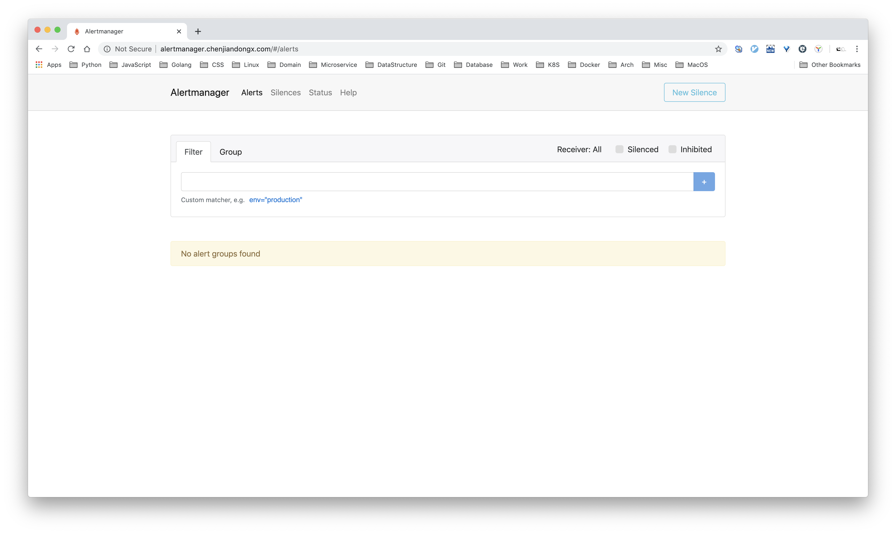
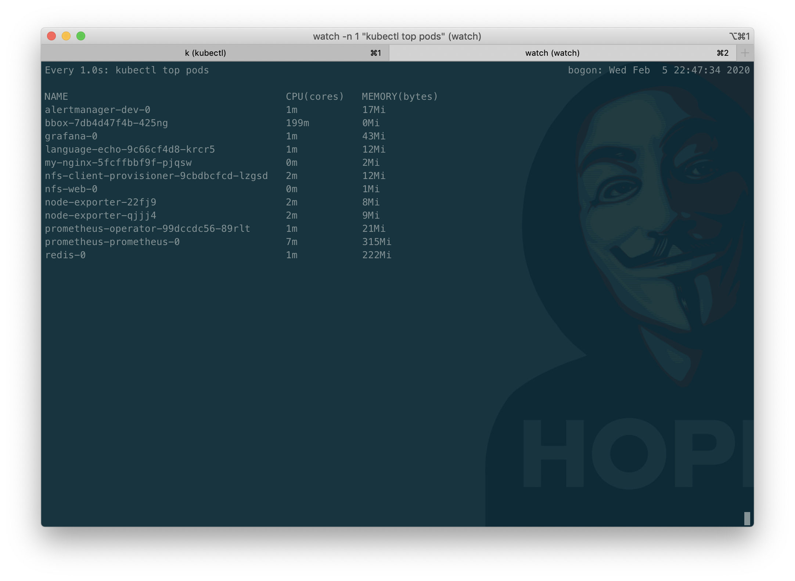
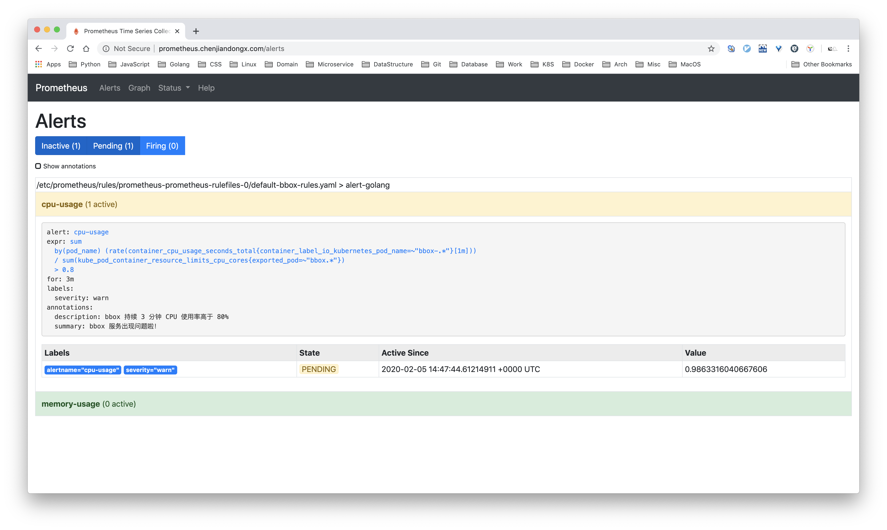
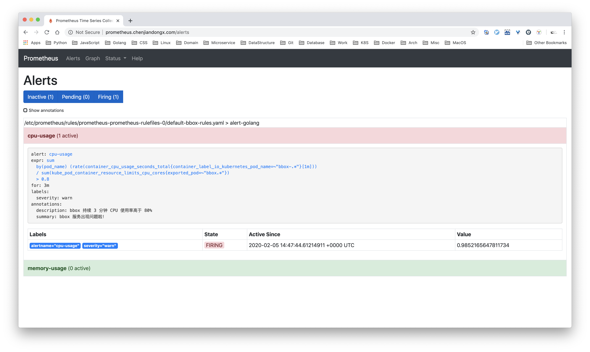
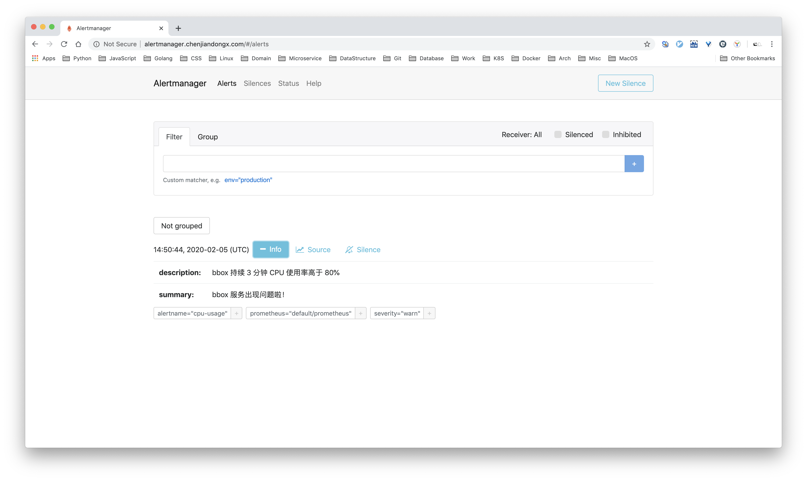
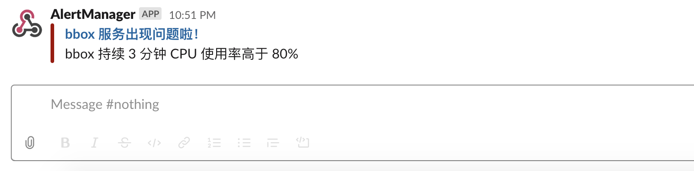

## 8. Alertmanager 告警系统

### 8.1 Alertmanager 是什么？

Prometheus 的分工还是比较明确的，Prometheus server 负责产生警告，而 Alertmanager 负责消费和处理警告。

Alertmanager 接受到来自 Prometheus 的告警后，需要删除重复、分组，并将它们通过路由发送到正确的接收器，比如电子邮件、Slack、钉钉等。Alertmanager 还支持沉默和警报抑制的机制。

#### 8.1.1 分组

分组是指当出现问题时，Alertmanager 会收到一个单一的通知，而当系统宕机时，很有可能成百上千的警报会同时生成，这个时候就需要将这些警告分组了。

例如当数十或数百个服务的实例在运行，网络发生故障时，有可能服务实例的一半不可达数据库。在告警规则中配置为每一个服务实例都发送警报的话，那么结果是数百警报被发送至Alertmanager。这个时候其实只需要发送一条警告就行，重复的警告有时候会干扰错误的判断。

#### 8.1.2 抑制

抑制是指当警报发出后，停止重复发送由此警报引发其他错误的警报的机制。

例如当警报被触发，通知整个集群不可达，可以配置 Alertmanager 忽略由该警报触发而产生的所有其他警报，这可以防止通知数百或数千与此问题不相关的其他警报。

#### 8.1.3 沉默

沉默是一种简单的特定时间静音提醒的机制（别吵，吵到我刷剧了 🐶）。一种沉默是通过匹配器来配置，就像路由树一样。传入的警报会匹配RE，如果匹配，将不会为此警报发送通知。

### 8.2 部署 Alertmanager

#### 8.2.1 部署 Alertmanager 实例

使用 prometheus-operator 部署 Alertmanager 特别简单。
```yaml
# alertmanager-dev.yaml
apiVersion: monitoring.coreos.com/v1
kind: Alertmanager
metadata:
  name: dev
spec:
  replicas: 1

# k apply -f alertmanager-dev.yaml
```

查看资源运行情况
```shell
🐶 k get pods | grep alert
alertmanager-dev-0                       2/2     Running   16         27d

# 该 pod 里面有两个 container，另外一个负责更新配置。
🐶 k describe pod alertmanager-dev-0 | grep Image:
    Image:         quay.io/prometheus/alertmanager:v0.17.0
    Image:         quay.io/coreos/configmap-reload:v0.0.1
```

#### 8.2.2 部署 alertmanager-svc

Alertmanager 本身也提供了一个可视化面板，先把 service 部署起来。
```yaml
# alertmanager-dev-svc.yaml
apiVersion: v1
kind: Service
metadata:
  name: alertmanager-dev
spec:
  type: ClusterIP
  ports:
  - name: web
    port: 9093
    protocol: TCP
    targetPort: web
  selector:
    alertmanager: dev

# k apply -f alertmanager-dev-svc.yaml
```

#### 8.2.3 部署 Ingress

同样的，部署一个 Ingress 资源用来转发 http://alertmanager.chenjiandongx.com 域名。
```yaml
# ingress-alertmanager.yaml
apiVersion: extensions/v1beta1
kind: Ingress
metadata:
  name: ingress-alertmanager
  namespace: default
  annotations:
    kubernetes.io/ingress.class: "nginx"
    nginx.ingress.kubernetes.io/backend-protocol: "HTTP"
spec:
  rules:
  - host: alertmanager.chenjiandongx.com
    http:
      paths:
        - path: /
          backend:
            serviceName: alertmanager-dev
            servicePort: 9093

# k apply -f ingress-alertmanager.yaml
# 老规矩，记得更新 /etc/hosts 文件
```



### 8.3 准备 Alertmanager 测试环境

#### 8.3.1 部署测试 busybox

Alertmanager 部署完以后我们就要来使用啦，作为测试用途，我们先整一个小盒子。
```yaml
# bbox.yaml
apiVersion: apps/v1
kind: Deployment
metadata:
  labels:
    run: bbox
  name: bbox
spec:
  replicas: 1
  selector:
    matchLabels:
      run: bbox
  template:
    metadata:
      labels:
        run: bbox
    spec:
      containers:
      - image: busybox:1.28.4
        imagePullPolicy: IfNotPresent
        name: bbox
        resources:
          limits:
            cpu: 200m
            memory: 25Mi
          requests:
            cpu: 200m
            memory: 25Mi
# k apply -f bbox.yaml
```

#### 8.3.2 创建 alertmanager 配置文件

根据 prometheus-operator 文档要求，需要先准备一个配置文件，定义警告的接受者。然后根据配置文件创建 secrets
```yaml
# alertmanager.yaml
global:
  resolve_timeout: 4m
receivers:
- name: slack_general
  slack_configs:
  - api_url: ${your_slack_api}
    #nothing 这个 channel 是我自己随便取的，没任何特殊含义
    channel: '#nothing'
    title: "{{ range .Alerts }}{{ .Annotations.summary }}\n{{ end }}"
    text: "{{ range .Alerts }}{{ .Annotations.description }}\n{{ end }}"
route:
 receiver: slack_general
 routes:
  - match:
      severity: warn
    receiver: slack_general
```

#### 8.3.3 创建 secret

使用 `kubectl create` 命令创建 secret
```shell
$ kubectl create secret generic alertmanager-example --from-file=alertmanager.yaml
```

#### 8.3.4 部署 kube-state-metrics

在上面的篇章中，我们已经部署了 cadvisor，这个是用于采集容器的实时数据的。但如果你要计算使用率的话，还需要了解该容器的限制资源为多少，这个时候就需要用到另外一个组件了。[kube-state-metrics](https://github.com/kubernetes/kube-state-metrics) 是一个由 Kubernetes 官方团队开发的采集容器和资源信息的项目。只有这两者相结合才能计算出资源的使用率。

```shell
$ git clone https://github.com/kubernetes/kube-state-metrics.git
$ cd kube-state-metrics
$ kubectl apply -f examples/standard
```

查看部署情况
```shell
~ 🐶 k get pods -A | grep kube-state
kube-system            kube-state-metrics-676545cdcc-wzlld          1/1     Running   8          27d
```

#### 8.3.5 通知 Promethues 抓取 kube-state-metrics 数据
```yaml
# kube-state-metrics-svc-monitor.yaml
apiVersion: monitoring.coreos.com/v1
kind: ServiceMonitor
metadata:
  labels:
    team: frontend
  name: kube-state-metrics
spec:
  endpoints:
  - port: http-metrics
  namespaceSelector:
    matchNames:
    - kube-system
  selector:
    matchLabels:
      app.kubernetes.io/name: kube-state-metrics

# k apply -f kube-state-metrics-svc-monitor.yaml
```

#### 8.3.6 创建定义告警规则

我们这里只进行两种规则的判断，CPU 和内存使用率持续 3 分钟内大于 80%。
```yaml
# bbox-rules.yaml
apiVersion: monitoring.coreos.com/v1
kind: PrometheusRule
metadata:
  labels:
    prometheus: prometheus
    role: alert-rules
  name: bbox-rules
spec:
  groups:
  - name: alert-golang
    rules:
    - alert: cpu-usage
      expr: sum(rate(container_cpu_usage_seconds_total{container_label_io_kubernetes_pod_name=~"bbox-.*"}[1m])) by (pod_name) / sum(kube_pod_container_resource_limits_cpu_cores{exported_pod=~"bbox.*"}) > 0.8
      for: 3m
      labels:
        # 匹配 alertmanager.yaml 中的 label
        severity: warn
      annotations:
        description: 'bbox 持续 3 分钟 CPU 使用率高于 80%'
        summary: 'bbox 服务出现问题啦！'
    - alert: memory-usage
      expr: sum(container_memory_usage_bytes{container_label_io_kubernetes_pod_name=~"bbox-.*"}) / sum(kube_pod_container_resource_requests_memory_bytes{exported_pod=~"bbox.*"}) > 0.8
      for: 3m
      labels:
        severity: warn
      annotations:
        description: 'bbox 持续 3 分钟内存使用率高于 80%'
        summary: 'bbox 服务出现问题啦！'

# k apply -f bbox-rules.yaml
```

### 8.4 实战 Alertmanager

下面我们要执行一些操作来触发告警规则，使用 kubectl 命令行进入到 bbox 容器内部。
```shell
$ k exec -it bbox-7db4d47f4b-425ng  /bin/sh
# 使用该命令迅速拉高 CPU 使用率
$ cat /dev/zero>/dev/null
```

使用 `kubectl top` 命令查看操作是否实际生效。可以看到 CPU 使用率杭来了。



等待一分钟，Promethues server CPU 警告规则已经处于 pending 状态。



再等待三分钟，CPU 警告规则已经处于 firing 状态。



查看 alertmanager dashboard，告警也已经被消费了。



最后一步，登录 slack 查看是否有真正接受到告警信息。



完美！✿✿ヽ(°▽°)ノ✿
