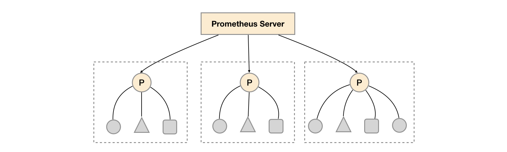

## 9. 高可用 Prometheus

鉴于自己的开发机器性能有限，也没有那么大数据量的业务场景。所以实际上高可用这部分我也没真正折腾过（诚实不做作！），不过也聊一聊社区一些现有的方案吧。

### 9.1 数据高可用

首先我们知道，Prometheus 本身的数据是不依赖与网络存储的，也就是说时序数据是存放在「本地的」，所以对于超大量数据来说瓶颈就很明显了。

但是不用慌，Prometheus 团队也考虑到这个事情了，Prometheus 提供了两种接口，remote-read 和 remote-write，意味着可以对接第三方的时序数据库，将旧数据堆放到其他地方。

***remote write***

用户可以在 Prometheus 配置文件中指定 ``remote_read`` 的 URL 地址，一旦设置了该配置项，Prometheus 将样本数据通过 HTTP 的形式发送给 Adaptor。而用户则可以在适配器中对接外部任意的服务。外部服务可以是真正的存储系统，公有云的存储服务，也可以是消息队列等任意形式。


***remote read***

在远程读的流程当中，当用户发起查询请求后，Prometheus 将向 `remote_read` 中配置的 URL 发起查询请求(matchers,ranges)，Adaptor 根据请求条件从第三方存储服务中获取响应的数据。同时将数据转换为 Prometheus 的原始样本数据返回给 Prometheus Server。

当获取到样本数据后，Prometheus 在本地使用 PromQL 对样本数据进行二次处理。


目前已经支持的 remote-* 接口的实现方案如下。

* [AppOptics](https://github.com/solarwinds/prometheus2appoptics): write
* [Azure Data Explorer](https://github.com/cosh/PrometheusToAdx): read and write
* [Azure Event Hubs](https://github.com/bryanklewis/prometheus-eventhubs-adapter): write
* [Chronix](https://github.com/ChronixDB/chronix.ingester): write
* [Cortex](https://github.com/cortexproject/cortex): read and write
* [CrateDB](https://github.com/crate/crate_adapter): read and write
* [Elasticsearch](https://github.com/infonova/prometheusbeat): write
* [Gnocchi](https://gnocchi.xyz/prometheus.html): write
* [Graphite](https://github.com/prometheus/prometheus/tree/master/documentation/examples/remote_storage/remote_storage_adapter): write
* [InfluxDB](https://docs.influxdata.com/influxdb/latest/supported_protocols/prometheus): read and write
* [IRONdb](https://github.com/circonus-labs/irondb-prometheus-adapter): read and write
* [Kafka](https://github.com/Telefonica/prometheus-kafka-adapter): write
* [M3DB](https://m3db.github.io/m3/integrations/prometheus): read and write
* [OpenTSDB](https://github.com/prometheus/prometheus/tree/master/documentation/examples/remote_storage/remote_storage_adapter): write
* [PostgreSQL/TimescaleDB](https://github.com/timescale/prometheus-postgresql-adapter): read and write
* [QuasarDB](https://doc.quasardb.net/master/user-guide/integration/prometheus.html): read and write
* [SignalFx](https://github.com/signalfx/metricproxy#prometheus): write
* [Splunk](https://github.com/kebe7jun/ropee): read and write
* [TiKV](https://github.com/bragfoo/TiPrometheus): read and write
* [Thanos](https://github.com/thanos-io/thanos): write
* [VictoriaMetrics](https://github.com/VictoriaMetrics/VictoriaMetrics): write
* [Wavefront](https://github.com/wavefrontHQ/prometheus-storage-adapter): write

### 9.2 Prometheus 服务高可用

Prometheus server 是没有原生的高可用方案的，不过它有一种联邦机制（Federation）。也就是说，可以把 prometheus 本身的数据上报给上层的 prometheus 实例，是一个层级结构。



联邦机制解决了什么问题呢。比如，你可以在一个数据中心部署一个 prometheus server，然后各个业务部门部署自己单独的 prometheus server，然后数据统一上报给数据中心，由数据中心负责对数据进行聚合。

然后问题又来了，如果我一个业务部门只部署了一个 prometheus server 用于抓取数据，这样就存在单点问题，万一这个 server 挂掉那不就会丢失重要的监控样本数据了。所以为了保险起见，是否要再部署一个副本，抓取相同的数据，做冗余备份呢？再继续思考，那我们是不是还得再部署一个 prometheus 来监控这两个 prometheus 的运行情况呢？🐶

仁者见仁，智者见智。

### 9.3 Alertmanager 高可用

Alertmanager 组件本身提供了高可用方案，所以在 prometheus-operator 中，只需要提高 replica 数量即可（舒服！）。
```yaml
apiVersion: monitoring.coreos.com/v1
kind: Alertmanager
metadata:
  name: dev
spec:
  # 提高备份数即可。
  replicas: 1
```

### 敲黑板！划重点！

Prometheus 的折腾之旅到这里就告一段落啦，通过这段时间的捣鼓也学习到了不少东西。最后还是一句话，多翻文档，多动手。如果后面有再更新的话，那应该是「源码解析篇」🙃。

**:wq**
